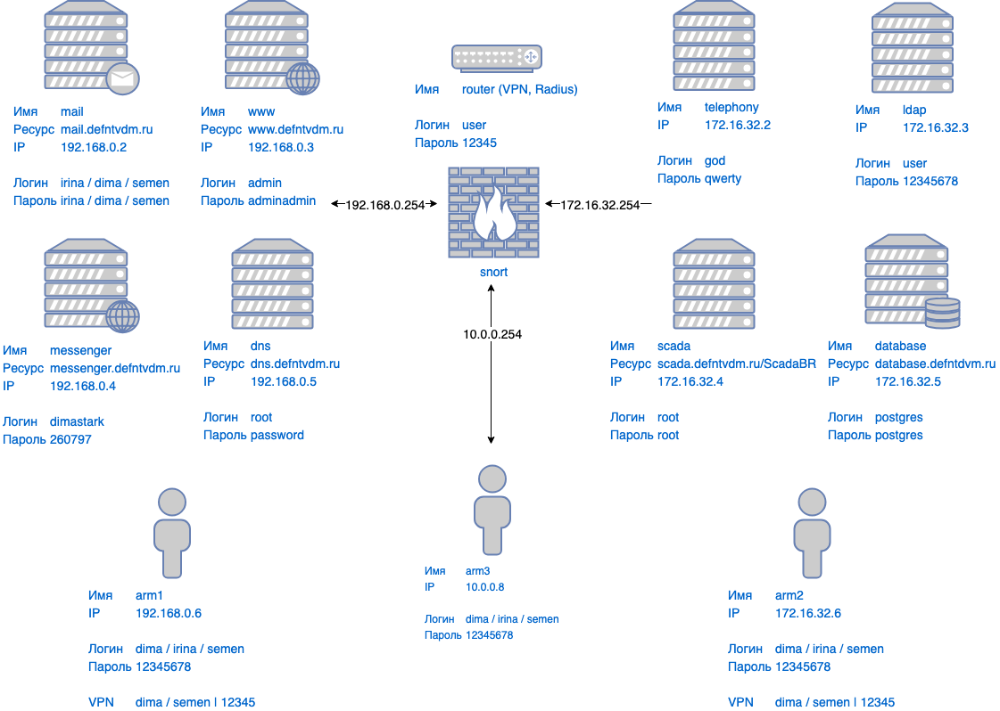

# Развертывание СОПКА

## Подготовили:

| Студент         | Зона ответственности                     |
|-----------------|------------------------------------------|
| Старков Дмитрий | **dns** / **mail** / **www**             |
| Седова Ирина    | **ldap** / **messenger** / **snort**     |
| Николаев Вадим  | **radius** / **router** / **vpn**        |
| Мамонов Антон   | **database** / **scada** / **telephony** |
| Махаев Семен    | **arm1** / **arm2** / **arm3**           |

## Cхема сети

## Первоначальная настройка

### router

1. Запускаем виртуальную машину **router**
2. Авторизуемся **user** пароль **12345**
3. Следуем инструкциям **snort** / **vpn** / **radius**

### snort

0. Открываем виртуальную машину **router**
1. Проверяем, что **snort** запущен **service snort status**
2. Если нет, то запускаем **service snort start**
3. Правила нужно писать в **/etc/snort/my.conf**
4. Логи нужно смотреть в **/var/log/snort/alert**

### vpn

0. Открываем виртуальную машину **router**
1. Проверяем, что **openvpn@server** стартанул **service openvpn@server status**
2. Если нет, то перезапускаем **service openvpn@server restart**
3. Открываем один из **arm** и запускаем **service openvpn-client@client restart**
4. Пользователи **dima** / **semen** пароль **12345**

### radius

0. Открываем виртуальную машину **router**
1. Проверяем, что **freeradius** стартанул **service freeradius status**
2. Если нет, то перезапускаем **service freeradius restart**

### ldap

1. Запускаем виртуальную машину **ldap**
2. Авторизуемся **user** пароль **12345678**
3. Открываем один из **arm** и пытаемся сделать **sudo ald-client join server.domain**
4. Пользователи: **irina** / **dima** / **semen** пароль **12345678**

### dns

1. Запускаем виртуальную машину **dns**
2. Авторизуемся **root** (без пароля)
3. Убеждаемся, что все сервисы стартанули **docker ps**
4. Проверяем работу dns **nslookup messenger.defntvdm.ru 192.168.0.5**

### messenger

1. Запускаем виртуальную машину **messenger**
2. Авторизуемся **root** (без пароля)
3. Убеждаемся, что все сервисы стартанули **docker ps**
4. Переходим на **http://messenger.defntvdm.ru**

### telephony

1. Запускаем виртуальную машину **telephony**
2. Авторизуемся **god** пароль **qwerty**
3. Открываем один из **arm** и запускаем **linphone**

### mail

1. Запускаем виртуальную машину **mail**
2. Авторизуемся **root** (без пароля)
3. Убеждаемся, что все сервисы стартанули **docker ps**
4. Пользователи: **irina@mail.defntvdm.ru** пароль **irina**, **semen@mail.defntvdm.ru** пароль **semen**, **dima@mail.defntvdm.ru** пароль **dima**

### scada

1. Запускаем виртуальную машину **scada**
2. Авторизуемся **root** (без пароля)
3. Убеждаемся, что все сервисы стартанули **docker ps**
4. Проверяем доступность морды **http://scada.defntvdm.ru/ScadaBR**

### database

1. Запускаем виртуальную машину **database**
2. Авторизуемся **root** (без пароля)
3. Убеждаемся, что все сервисы стартанули **docker ps**
4. Проверяем доступность админки **http://database.defntvdm.ru**

### www

1. Запускаем виртуальную машину **www**
2. Авторизуемся **root** (без пароля)
3. Убеждаемся, что все сервисы стартанули **docker ps**
4. Проверяем доступность форума **http://www.defntvdm.ru**
5. В случае проблем, стоит посмотреть логи **docker logs www**
6. Так же стоит проверить связь с БД **ping 172.16.32.5**
7. Администратор форума: **admin** пароль **adminadmin**
